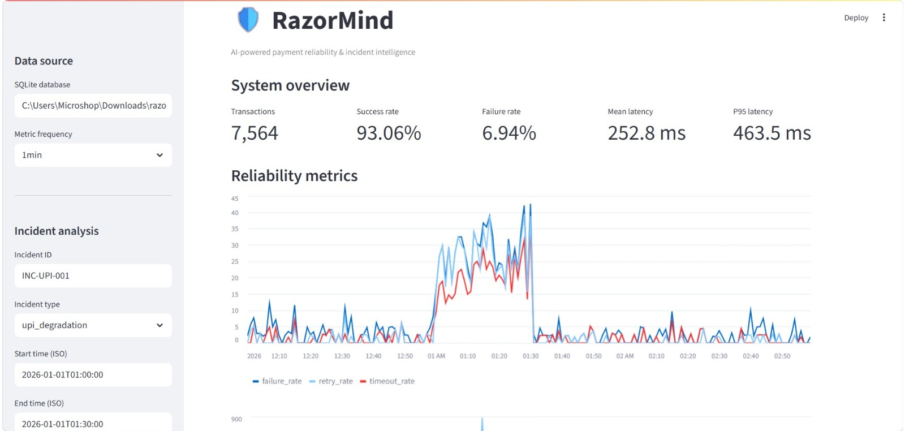
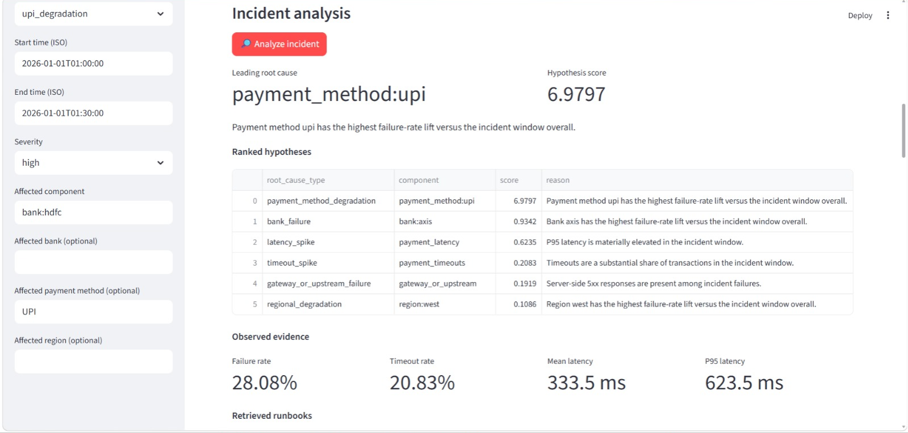
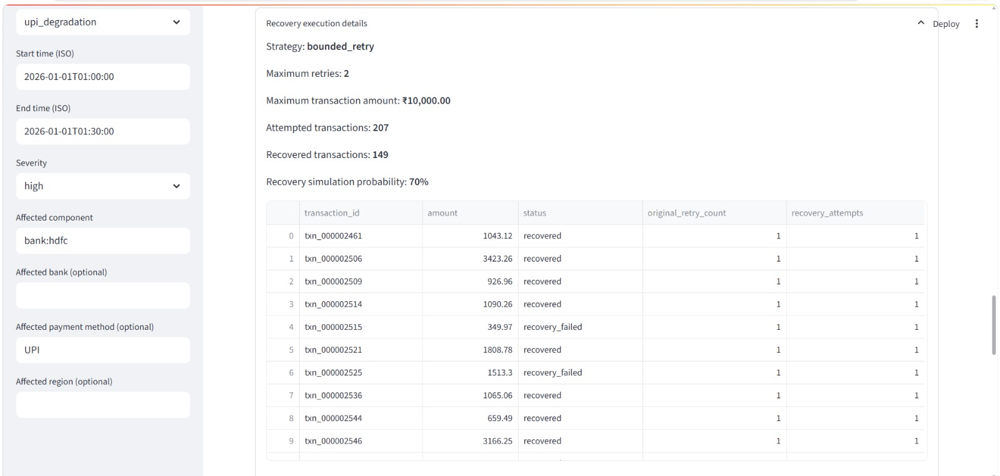
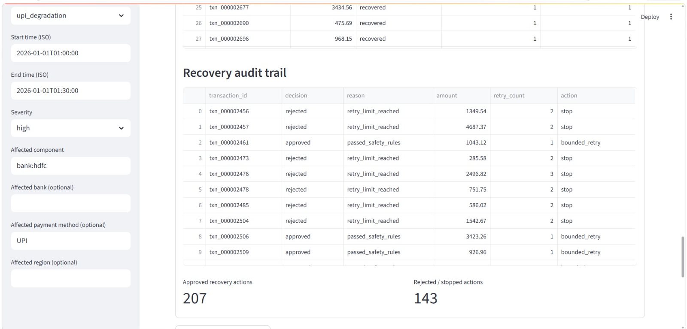
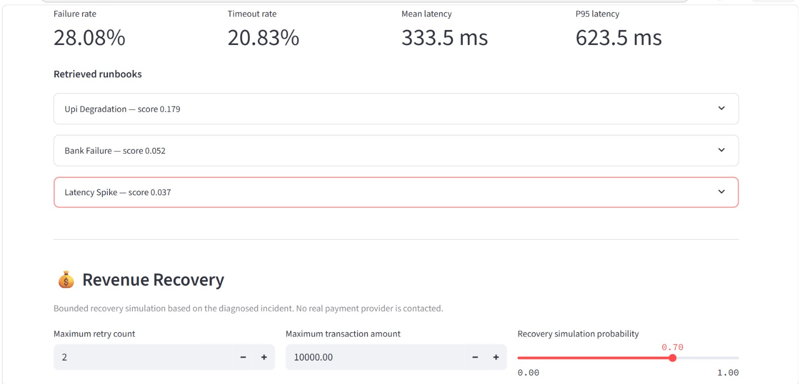

# RazorMind

## AI-Powered Payment Reliability & Incident Intelligence

RazorMind is an end-to-end payment reliability and incident intelligence system that detects payment incidents, diagnoses their root causes, estimates financial impact, executes bounded recovery strategies, and generates grounded incident reports.

Built for the **Razorpay AI Buildathon 2026**.

> **Core principle:** Use deterministic systems for detection and control. Use AI for reasoning and explanation.

---

## 🚨 The Problem

Payment failures are not just engineering problems.

A degraded payment method, bank, processor, or gateway can cause:

- Increased payment failures
- Higher latency and timeouts
- Retry storms
- Lost transaction value
- Difficult and slow root-cause investigation
- Delayed recovery

Traditional monitoring can tell an engineering team that something is wrong.

RazorMind goes further:

> **Detect → Diagnose → Quantify financial impact → Decide recovery → Execute bounded recovery → Measure recovery → Explain with AI**

---

# 💡 What RazorMind Does

RazorMind processes transaction-level payment data through a complete incident-response pipeline:

```text
Payment Transactions
        ↓
Incident Injection
        ↓
Metrics Aggregation
        ↓
Statistical Detection
        ↓
Incident Correlation
        ↓
Deterministic Root-Cause Diagnosis
        ↓
Revenue at Risk
        ↓
Bounded Recovery Strategy
        ↓
Safety Checks
        ↓
Simulated Recovery Execution
        ↓
Recovery Evaluation
        ↓
RAG Runbook Retrieval
        ↓
Grounded LLM Incident Report
```

The LLM is **not responsible for detecting incidents or deciding the root cause**.

---

# 💰 Demonstration Result

For the demonstrated **UPI degradation incident**, RazorMind produced the following recovery outcome:

| Metric | Result |
|---|---:|
| Revenue at Risk | **₹450,208.78** |
| Eligible Revenue | **₹286,845.77** |
| Revenue Recovered | **₹191,964.11** |
| Remaining Risk | **₹258,244.67** |
| Eligible Transactions | **216** |
| Recovered Transactions | **154** |
| Transaction Recovery Rate | **71.30%** |
| Revenue Recovery Rate | **42.64%** |
| Eligible Revenue Recovered | **66.92%** |
| Recovery Strategy | **bounded_retry** |
| Maximum Retries | **2** |
| Maximum Transaction Amount | **₹10,000** |

### Recovery safety

The system evaluated candidate failed transactions before attempting recovery:

```text
360 failed transactions evaluated
        ↓
216 passed safety rules
        ↓
216 bounded recovery attempts
        ↓
144 actions rejected/stopped
```

Every candidate receives an audit record explaining whether recovery was approved or stopped.

> **Important:** Recovery execution is simulated. RazorMind does not call a real payment provider or execute real financial transactions.

---

# 🧠 Why Deterministic Detection + AI?

RazorMind deliberately separates **control** from **reasoning**.

### Deterministic systems handle:

- Metric calculation
- Baseline comparison
- Anomaly detection
- Incident correlation
- Root-cause scoring
- Revenue-at-risk calculation
- Recovery eligibility
- Safety constraints
- Recovery evaluation

### AI handles:

- Incident summarization
- Evidence explanation
- Runbook-grounded recommendations
- Human-readable incident reporting

This makes the system more:

- Reproducible
- Explainable
- Testable
- Safer
- Easier to audit

---

# 🏗️ System Architecture

```text
                    ┌─────────────────────┐
                    │ Payment Simulator   │
                    └──────────┬──────────┘
                               ↓
                    ┌─────────────────────┐
                    │ Incident Injector   │
                    └──────────┬──────────┘
                               ↓
                    ┌─────────────────────┐
                    │ Metrics Engine      │
                    └──────────┬──────────┘
                               ↓
                    ┌─────────────────────┐
                    │ Anomaly Detection   │
                    │ Rolling Baselines   │
                    │ Z-Score / EWMA       │
                    └──────────┬──────────┘
                               ↓
                    ┌─────────────────────┐
                    │ Incident Correlator │
                    └──────────┬──────────┘
                               ↓
                    ┌─────────────────────┐
                    │ Root Cause Engine   │
                    │ Structured Evidence │
                    └──────────┬──────────┘
                               ↓
                ┌──────────────┴──────────────┐
                ↓                             ↓
       ┌─────────────────┐          ┌─────────────────┐
       │ Revenue &        │          │ RAG Runbook     │
       │ Recovery Engine  │          │ Retrieval       │
       └────────┬────────┘          └────────┬────────┘
                ↓                             ↓
                └──────────────┬──────────────┘
                               ↓
                    ┌─────────────────────┐
                    │ LLM Incident Analyst│
                    └──────────┬──────────┘
                               ↓
                    ┌─────────────────────┐
                    │ Streamlit Dashboard │
                    └─────────────────────┘
```

---

# 🔄 End-to-End Incident Flow

## 1. Payment Simulation

RazorMind generates realistic transaction-level payment data containing:

- Transaction ID
- Timestamp
- Payment method
- Bank
- Transaction amount
- Status
- Latency
- Retry count

The simulator provides a controlled environment for testing incident detection and recovery.

---

## 2. Incident Injection

Controlled incidents can be injected into the transaction stream.

Supported scenarios include:

- UPI degradation
- Bank-specific degradation
- Payment-method degradation
- Increased failure rates
- Increased latency
- Increased timeouts
- Increased retries

Each incident has structured metadata:

```text
Incident ID
Incident Type
Start Time
End Time
Severity
Affected Component
Affected Payment Method
Expected Symptoms
```

This allows the system to evaluate whether the detection pipeline correctly identifies known incidents.

---

# 📊 Metrics & Detection

RazorMind aggregates transaction-level data into operational metrics including:

- Transaction volume
- Success rate
- Failure rate
- Mean latency
- P95 latency
- Timeout rate
- Retry rate
- Payment-method performance
- Bank performance

### Statistical detection

RazorMind does **not** use an LLM as the primary incident detector.

Detection uses deterministic/statistical techniques such as:

- Rolling baselines
- Z-score analysis
- EWMA-style monitoring
- Threshold-based anomaly signals

This keeps incident detection reproducible and auditable.

---

# 🔍 Incident Correlation

Once anomalous behavior is detected, RazorMind correlates signals across:

- Time windows
- Payment methods
- Banks
- Failure rates
- Latency
- Timeout behavior
- Retry behavior

The goal is to determine whether the degradation is:

- Broad
- Payment-method specific
- Bank specific
- Component specific

---

# 🎯 Deterministic Root-Cause Diagnosis

RazorMind extracts structured evidence from the incident window.

Root-cause candidates are scored using observed evidence rather than generated by the LLM.

Relevant dimensions include:

```text
Payment Method
Bank
Processor
Failure Rate
Timeout Rate
Latency
Retry Behavior
```

For the demonstrated incident, the leading hypothesis was:

```text
payment_method:upi
```

The LLM receives this diagnosis as authoritative context and is explicitly prevented from replacing it with an invented root cause.

> **The LLM explains the diagnosis. It does not invent the diagnosis.**

---

# 💰 Revenue at Risk

Technical incident metrics do not fully describe the business impact.

RazorMind calculates:

```text
Revenue at Risk
        ↓
Eligible Revenue
        ↓
Recovery Strategy
        ↓
Revenue Recovered
        ↓
Remaining Risk
```

Revenue at risk is calculated from failed transactions occurring inside the affected incident window.

The calculation can be restricted using:

- Incident time window
- Payment method
- Bank
- Other incident constraints

This connects operational reliability directly to financial impact.

---

# ⚙️ Bounded Recovery

RazorMind includes a controlled recovery engine for eligible failed transactions.

The recovery pipeline is:

```text
Failed Transaction
        ↓
Safety Checks
        ↓
Eligible?
   ↙          ↘
 NO            YES
 ↓              ↓
STOP       Bounded Retry
               ↓
        Recovery Evaluation
```

### Safety constraints

A transaction must satisfy rules such as:

- It falls inside the incident window
- It matches the affected payment method
- It matches the affected bank when applicable
- Retry count is below the configured limit
- Transaction amount is below the configured maximum

For the demonstration:

```text
Maximum retries: 2
Maximum transaction amount: ₹10,000
Recovery strategy: bounded_retry
```

---

# 🛡️ Auditability & Safety

Every recovery candidate receives an audit record.

Example decisions include:

```text
passed_safety_rules
retry_limit_reached
amount_limit_exceeded
```

This creates a transparent trail of:

- Approved recovery actions
- Rejected actions
- Safety reasons
- Recovery outcomes

RazorMind therefore demonstrates **bounded automation rather than unrestricted financial automation**.

---

# 📈 Recovery Evaluation

After the simulated recovery run, RazorMind evaluates:

- Revenue recovered
- Remaining revenue risk
- Revenue recovery rate
- Eligible revenue recovery rate
- Transaction recovery rate
- Recovered transaction count
- Failed transaction count

This creates a measurable **before vs after** view of incident impact.

---

# 📚 RAG Runbook Retrieval

RazorMind uses Retrieval-Augmented Generation to provide operational context to the incident analyst.

The pipeline is:

```text
Runbooks
   ↓
Document Processing
   ↓
Searchable Representation
   ↓
Similarity Retrieval
   ↓
Relevant Runbooks
   ↓
LLM Incident Analysis
```

The knowledge base includes operational guidance for scenarios such as:

- UPI degradation
- Bank failures
- Processor failures
- Gateway issues
- High latency
- Timeouts

The current implementation uses a lightweight TF-IDF + cosine-similarity retrieval approach.

This keeps the RAG pipeline transparent and easy to evaluate.

---

# 🤖 Grounded LLM Incident Analyst

The LLM receives:

- Deterministic incident diagnosis
- Structured evidence
- Retrieved runbooks
- Revenue-at-risk information
- Recovery strategy
- Actual recovery outcome

It produces a structured incident report containing:

```text
Summary
Severity
Likely Root Cause
Affected Components
Evidence
Recommended Actions
Confidence
```

The analyst is explicitly grounded in supplied evidence.

It is not allowed to:

- Invent metrics
- Invent root causes
- Invent recovery results
- Replace the deterministic diagnosis
- Replace actual recovery outcomes with hypothetical results

---

# 🖥️ Dashboard

The Streamlit dashboard provides a complete incident-response view including:

- Incident configuration
- Detection results
- Root-cause diagnosis
- Evidence
- Revenue at risk
- Recovery strategy
- Recovery results
- Safety/audit information
- Retrieved runbooks
- LLM incident analysis

## Dashboard



## Root Cause Diagnosis



## Revenue Recovery



## Safety & Audit Trail



## RAG Runbook Retrieval



---

# 🧪 Evaluation

RazorMind includes automated tests covering the major system components.

Current test suite:

```text
86 tests passed
```

Run:

```bash
python -m pytest -q
```

The evaluation framework covers areas including:

### Detection

- Precision
- Recall
- F1
- Detection hit rate
- Detection delay

### Diagnosis

- Root-cause accuracy
- Component accuracy
- Evidence consistency

### RAG

- Retrieval hit rate
- Ranking quality
- MRR-style evaluation

### LLM

- Structured JSON validity
- Grounding checks
- Root-cause consistency

### Recovery

- Revenue recovered
- Revenue recovery rate
- Transaction recovery rate
- Remaining risk
- Safety-rule enforcement

---

# 📁 Project Structure

```text
razormind/
│
├── app/
│   ├── dashboard.py
│   │
│   ├── simulator/
│   │   ├── generator.py
│   │   ├── incidents.py
│   │   └── schema.sql
│   │
│   ├── detection/
│   │   ├── metrics.py
│   │   ├── baseline.py
│   │   └── detector.py
│   │
│   ├── diagnosis/
│   │   ├── evidence.py
│   │   └── root_cause.py
│   │
│   ├── rag/
│   │   ├── ingest.py
│   │   ├── retriever.py
│   │   └── knowledge_base/
│   │
│   ├── llm/
│   │   └── analyst.py
│   │
│   ├── recovery/
│   │   ├── revenue.py
│   │   ├── strategy.py
│   │   ├── executor.py
│   │   ├── evaluator.py
│   │   └── pipeline.py
│   │
│   └── evaluation/
│       ├── detection_metrics.py
│       ├── diagnosis_metrics.py
│       └── evaluation_runner.py
│
├── data/
│   ├── raw/
│   ├── processed/
│   └── razormind.db
│
├── models/
├── notebooks/
│
├── tests/
│   ├── test_generator.py
│   ├── test_incidents.py
│   ├── test_detection.py
│   ├── test_diagnosis.py
│   ├── test_rag.py
│   ├── test_llm.py
│   ├── test_evaluation.py
│   └── test_recovery.py
│
├── dashboard.jpeg
├── diagnosis.png
├── recovery.png
├── safety-audit.png
├── rag.png
│
├── requirements.txt
├── README.md
└── .gitignore
```

---

# 🛠️ Tech Stack

### Core

- Python
- Pandas
- NumPy
- SQLite

### Detection & Retrieval

- Statistical anomaly detection
- Rolling baselines
- Z-score / EWMA-style monitoring
- Scikit-learn
- TF-IDF
- Cosine similarity

### AI

- Ollama
- Local LLM
- Retrieval-Augmented Generation

### Interface

- Streamlit

### Testing

- Pytest

---

# 🚀 Getting Started

## 1. Clone the repository

```bash
git clone https://github.com/Vijeta2512xyz/Razormind.git
cd Razormind
```

## 2. Install dependencies

```bash
pip install -r requirements.txt
```

## 3. Run the tests

```bash
python -m pytest -q
```

Expected result:

```text
86 passed
```

## 4. Launch the dashboard

```bash
streamlit run app/dashboard.py
```

---

# 🤖 Optional Local LLM Setup

RazorMind can use Ollama for local incident reporting.

Set the model:

### PowerShell

```powershell
$env:PYTHONPATH=(Get-Location).Path
$env:RAZORMIND_OLLAMA_MODEL="phi:latest"
streamlit run app/dashboard.py
```

Make sure Ollama is running locally and the selected model is available.

The deterministic detection, diagnosis, recovery and evaluation pipeline does not depend on the LLM to determine the primary incident.

---

# 🔐 Safety & Production Considerations

The current recovery engine is intentionally simulated.

It does **not**:

- Call a real payment gateway
- Move real money
- Perform unrestricted retries
- Automatically execute real financial transactions

A production implementation would require additional controls such as:

- Human approval workflows
- Idempotency guarantees
- Real payment-provider APIs
- Transaction authorization
- Rate limiting
- Distributed locking
- Observability
- Rollback mechanisms
- Production audit storage
- Stronger policy enforcement

---

# 🔮 Future Work

Potential extensions include:

- Real-time transaction streaming
- Production payment-gateway integrations
- More advanced anomaly detection
- Learned root-cause ranking
- Hybrid sparse + dense retrieval
- Historical incident similarity
- Incident timelines
- Human-in-the-loop recovery approval
- Multi-incident correlation
- Distributed observability integration
- Production monitoring and alerting

---

# 🏆 Razorpay AI Buildathon 2026

RazorMind was built for the **Razorpay AI Buildathon 2026** around the problem of payment reliability and incident intelligence.

The project focuses on:

- Payment incident detection
- Deterministic root-cause analysis
- Financial impact estimation
- Revenue recovery
- Bounded automation
- RAG-based operational knowledge
- Grounded AI incident analysis
- Safety and auditability

The central design idea is simple:

> **Don't ask an LLM to guess what happened. First determine what happened using evidence — then use AI to explain it.**

---

# 👩‍💻 Author

**Vijeta Vadehi Bandha**

AI & ML Engineering

Built for the **Razorpay AI Buildathon 2026**
